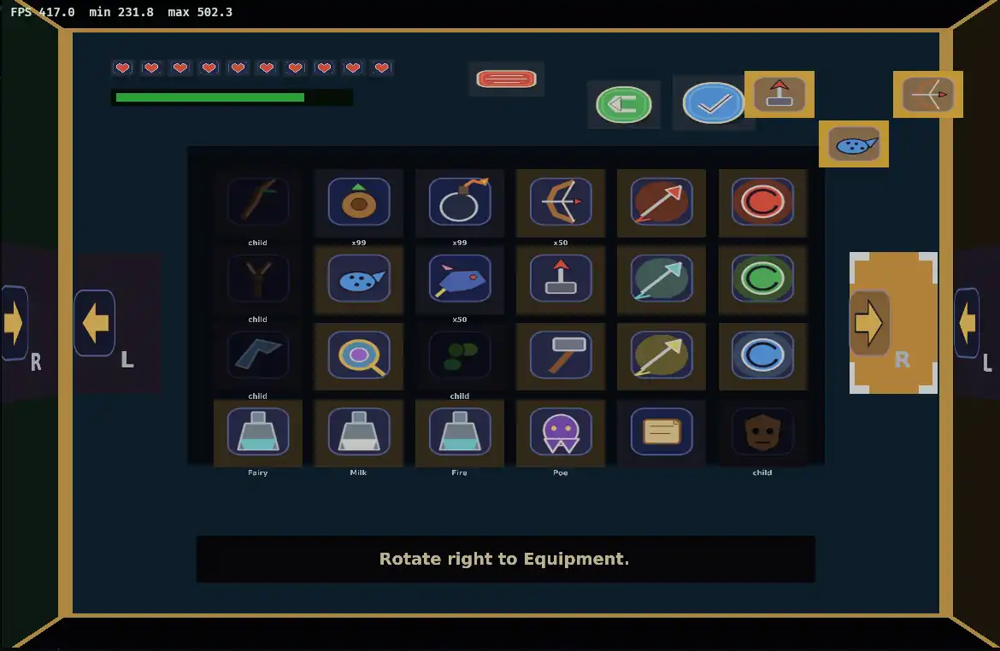

# bevy_lunex_oot_kaleidoscope_menu_demo

A standalone Bevy + Lunex demo of an Ocarina of Time-inspired kaleidoscope pause menu.

The demo icons are original procedural placeholder art generated locally and are not committed to the repository.



## Run

```bash
python3 -m pip install pillow
./run_demo.py
```

`run_demo.py` regenerates the icons into `assets/icons/oot/` and launches the release build. The entire `assets/` directory is git-ignored.

## README animation

With Pillow and `ffmpeg` installed, regenerate `screenshot.webp` from a deterministic full cube rotation:

```bash
./capture_readme_animation.py
```

The capture frames are temporary; the script leaves only the compressed animated WebP in the working tree.

## Controls

- `Q` / `E` or `PageUp` / `PageDown`: rotate pages
- Arrow keys or `WASD`: move selection
- `Enter` / `Space`: activate
- `Backspace` or right click: back
- `Esc` / `P`: open or close the pause menu
- Mouse wheel: rotate pages
- Gamepad triggers: rotate pages
- Gamepad D-pad: move selection
- South face button: activate
- East face button: back
