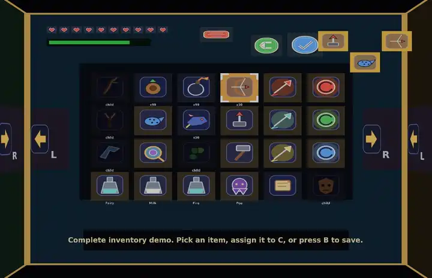

# bevy_lunex_oot_kaleidoscope_menu_demo

A standalone Bevy + Lunex demo of an Ocarina of Time-inspired kaleidoscope pause menu.

The demo icons are original procedural placeholder art generated locally and are not committed to the repository.



## Run

```bash
python3 -m pip install pillow
./run_demo.py
```

`run_demo.py` generates the icons into `assets/icons/oot/` when needed and launches the release build. The entire `assets/` directory is git-ignored.

## README animation

With `ffmpeg` installed, regenerate `animation.webp`:

```bash
./capture_readme_animation.py
```

Capture mode drives the real keyboard input path through a short showcase: pause/unpause, arrow-key navigation, C-button equips including the Light Arrow, page-edge rotation, and interactions on the Items, Equipment, Quest, and Map pages.

The capture is deterministic and simulation pauses while each PNG is written. Temporary frames are discarded after ffmpeg produces the animated WebP. Defaults are tuned for README use (12 fps, 720px wide, 5 MiB soft size target); use `--help` to adjust them.

## Controls

- `Q` / `E` or `PageUp` / `PageDown`: rotate pages
- Arrow keys or `WASD`: move selection
- `Enter` / `Space`: activate
- `Backspace` or right click: back
- `Esc` / `P`: open or close the pause menu
- Mouse wheel: rotate pages
- Gamepad triggers: rotate pages
- Gamepad D-pad: move selection
- South face button: activate
- East face button: back
